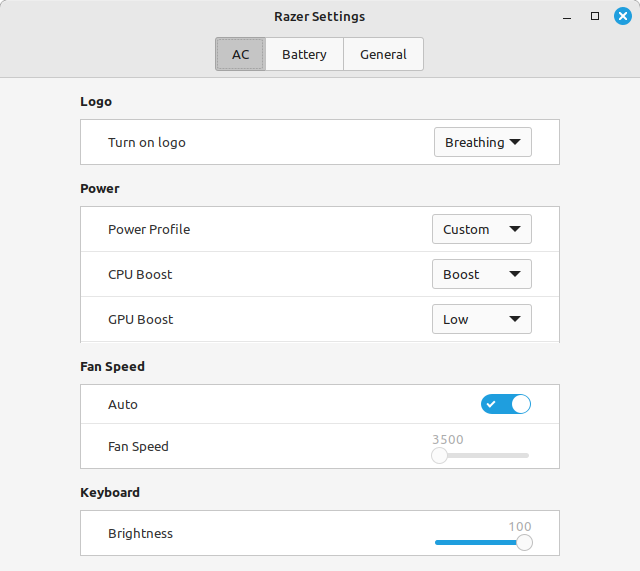

# Experimental code in here!

## Current features
* Full background daemon - Auto load state on machine startup based on last configuration
* CLI and GUI application for adjusting basic settings



## Installing
1. Install cargo or rustc
2. add `libdbus-1-dev libusb-dev libhidapi-dev libhidapi-hidraw0 pkg-config libudev-dev libgtk-3-dev` packages (or equivelent)
3. run `./install.sh install` as a normal user
4. reboot
5. Enjoy!

## Usage of CLI Application
```
razer-cli <action> <attribute> <power_state> <args> 
```

### action
* read - Read an attribute (get its current state) - No additional args are supplied
* write - Write an attribute, and save it to configuration - See below for argument counts

### attribute
* fan - Fan RPM. ARG: 0 = Auto, anything else is interpreted as a litteral RPM
* power - Power mode. ARG: 0 = Balanced, 1 = Gaming, 2 = Creator, 4 = Custom
* brightness - Change brightness of the keyboard
* logo - change logo state (for models with logo): 0 = off, 1 = on, 2 = breathing
* sync - sync light effect for battery/ac
* standard_effect - effects predefined in keyboard controller
* colour - Keyboard colour. ARGS: R G B channels, each channel is set from 0 to 255

### power_state
* ac
* bat

#### standard_effects
  * 'off'
  * 'wave' - PARAMS: <Direction>
  * 'reactive' - PARAMS: <Speed> <Red> <Green> <Blue>
  * 'breathing' - PARAMS: <Type> [Red] [Green] [Blue] [Red] [Green] [Blue]
  * 'spectrum'
  * 'static' - PARAMS: <Red> <Green> <Blue>
  * 'starlight' - PARAMS: <Type> [Red] [Green] [Blue] [Red] [Green] [Blue]

#### custom power control
Custom power control take two more parameters: cpu boost and gpu boost
* 0 - low power
* 1 - normal
* 2 - high
* 3 - boost (only for CPU and only for Advanced 2020 model and Studio Edition) 
```
razer-cli write power ac 4 3 2
```
